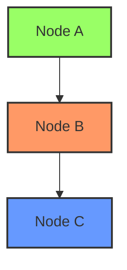

```mermaid
graph TD
 A[Node A]:::classGreen
 B[Node B]:::classRed
 C[Node C]:::classBlue

 A --> B
 B --> C

 classDef classGreen fill:#9f6,stroke:#333,stroke-width:2px
 classDef classRed fill:#f96,stroke:#333,stroke-width:2px
 classDef classBlue fill:#69f,stroke:#333,stroke-width:2px
```
